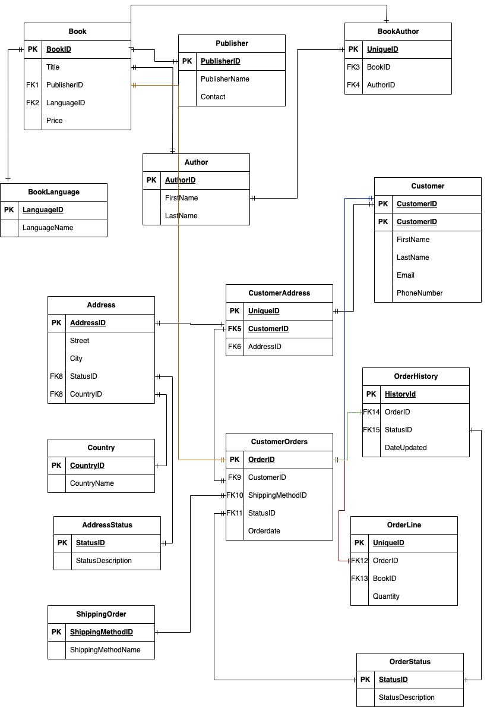

# Bookstore Database 

## Overview
The **Bookstore Database** is a relational database management system that organizes and manages information for a bookstore. This project demonstrates the structured implementation of various tables, data relationships, and operations required to handle a real-world bookstore's transactions, customers, and inventory.

The goal of the system is to:
- Facilitate efficient management of book inventory, customer details, orders, and authors.
- Ensure data consistency through robust relationships and foreign key constraints.
- Enable scalability for future requirements.

---

## Database Features

### Key Functionalities
- Maintain detailed information about customers, books, authors, publishers, and orders.
- Handle many-to-many relationships effectively (e.g., between books and authors).
- Track order history and shipping methods.
- Enforce data integrity using primary and foreign key constraints.

---

## Database Schema

### Tables and Descriptions

- **Customer**: Stores information about customers, such as names, contact details, and unique IDs.
- **CustomerAddress**: Associates customers with their respective addresses.
- **Country**: Lists the countries associated with customer addresses.
- **AddressStatus**: Tracks the status of customer addresses (e.g., current or old).
- **Address**: Contains detailed address information.
- **ShippingMethod**: Lists available shipping methods for order delivery.
- **OrderStatus**: Provides the current status of an order (e.g., delivered, canceled).
- **CustomerOrders**: Tracks orders placed by customers, including shipping and order status.
- **OrderLine**: Represents the details of books included in each order.
- **OrderHistory**: Logs changes in the status of orders over time.
- **Author**: Contains details about authors of books.
- **Publisher**: Tracks book publishers and their contact information.
- **BookLanguage**: Stores available languages for books.
- **Book**: Manages book inventory, including pricing and foreign keys for publishers and languages.
- **BookAuthor**: A junction table linking books and their authors.

## ERD

## Contributors

We would like to acknowledge the following individuals for their contributions to this project:

- [Zebidah Wanjiku](https://github.com/ZebidahM) 
- [Sheilla Mungai](https://github.com/sheemungai)
- [John Mwaura](https://github.com/janco-arch) 

If you'd like to contribute to this project, feel free to create a pull request or reach out to us!
